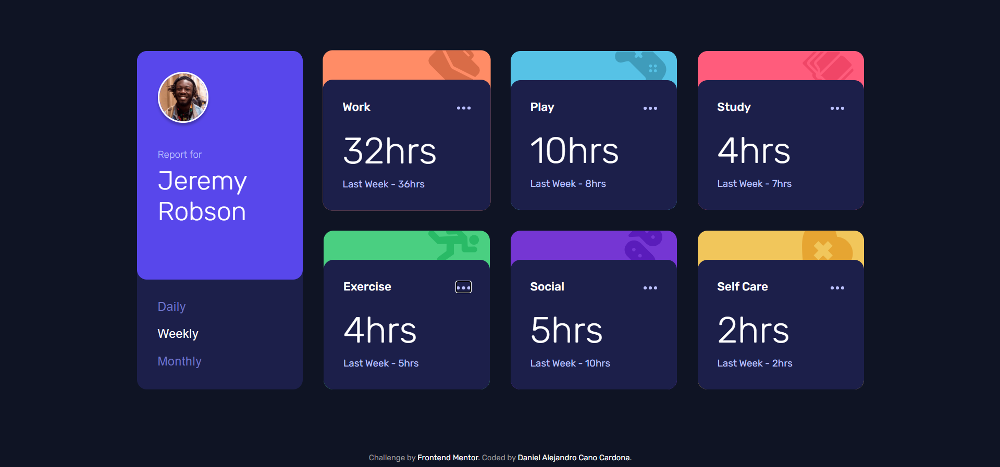
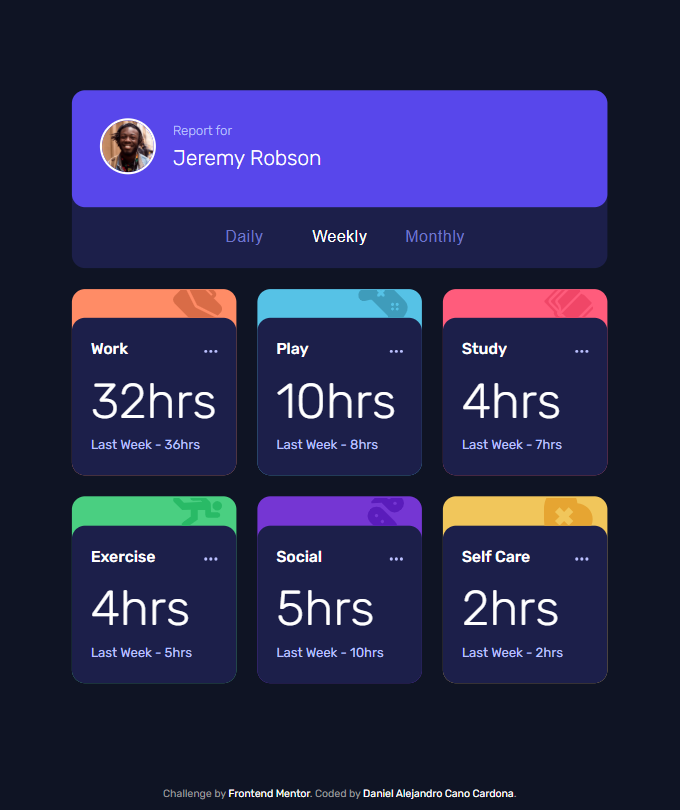
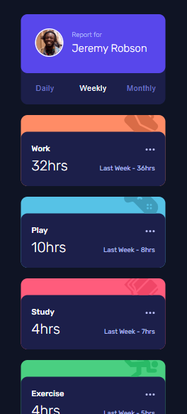

# Frontend Mentor - Time tracking dashboard solution ✅


This is a solution to the **[Time tracking dashboard challenge on Frontend Mentor](https://www.frontendmentor.io/challenges/time-tracking-dashboard-UIQ7167Jw)** by **[Dacardonac](https://github.com/Dacardonac)**. Frontend Mentor challenges help you improve your coding skills by building realistic projects.

## Table of contents 📄

- **[Frontend Mentor - Time tracking dashboard](#frontend-mentor---time-tracking-dashboard-solution-)**
  - **[Table of contents](#table-of-contents-)**
  - **[Overview](#overview-)**
    - [The challenge](#the-challenge-)
    - [Screenshot](#screenshots-)
    - [Links](#links-)
    - [How to use](#how-to-use-the-project-)
  - **[My process](#my-process-)**
    - [Built with](#built-with-)
    - [What I learned](#what-i-learned-)
    - [Continued development](#continued-development-)
    - [Useful resources](#useful-resources-)
  - **[Author](#author-)**
  - **[Acknowledgments](#acknowledgments-)**

## Overview

### The challenge 🧩

**Users should be able to see in this project:**

- View the optimal layout depending on their device's screen size (Responsive)
- Styles in Components (Sass/Scss)
- DOM (Document Object Model)
- BEM Methodology (Block Element Modifier)
- Alerts
- Data JSON
- Accessibility (a11y)

### Screenshots 📷

Desktop 🖥️

****

Tablet 📱

****

Mobile 🤳

****


### Links 📍

- Solution URL: **[Frontend Mentor Solution 👨‍💻](https://www.frontendmentor.io/solutions/time-tracking-dashboard-html-scss-js-u_Kh1TYAVKhttps://www.frontendmentor.io/solutions/time-tracking-dashboard-html-scss-js-u_Kh1TYAVK)**
- Live Site URL: **[Solution Deploy in Vercel 🚀](https://fem-time-tracking-dashboard-five.vercel.app/)**

### How to Use the Project 💻

To use this project, you need to follow these steps:

1. **Clone the repository**:

  ```bash
  git clone https://github.com/Dacardonac/fem-time-tracking-dashboard.git
  ```

2. **Navigate to the project directory 📂**:

  ```bash
  cd fem-time-tracking-dashboard
  ```

3. **Install dependencies ⬇️: Make sure you have Node.js installed, then run**:

  ```bash
  npm install
  ```

4. **Run the project ▶️: Start the development server with**:

  ```bash
  npm run dev
  ```
  This will start the project locally, typically accessible at `http://localhost:3000`.

5. **If you want to see a preview of the project ▶️**:

  ```bash
  npm run build
  npm run preview
  ```
  **This will start the Preview server on `http://localhost:4173`.**

## My process 🎓

### Built with 🛠

- Semantic HTML5 Markup - Structure
- CSS3 Custom Properties - Styles
- Mobile-first Workflow
- JavaScript - Programming Logic
- Flexbox - Spaces and Alignments
- Conventional Commits - Commit Specification
- json-server - Backend (Data Base)
- [Vite](https://vitejs.dev/) - Frontend Tooling
- [Sass/Scss](https://sass-lang.com/) - Modules and Styles
- [BEM Methodology](https://en.bem.info/methodology/) - Nomenclature for Classes
- [SweetAlert2](https://sweetalert2.github.io/) - Alerts
- Markdown - README.md file (Documentation)

### What I learned 🧠

With this project, I learned, implemented, and practiced **JavaScript**, along with its properties and methods, such as **fetch**. I also reinforced and practiced my **CSS3** knowledge with **Sass/Scss**, worked on semantic **HTML5** by applying the **BEM** methodology for class naming.

**You can see an example below:**

``` JavaScript

  function printCards(data, timeframe) {
    const container = document.getElementById('cards-container');
    container.innerHTML = '';

    data.forEach((item) => {
      const article = document.createElement('article');
      article.classList.add('card');
      article.style.backgroundColor = `var(--${item.title.toLowerCase().replace(/ /g, '-')})`;
      article.setAttribute('aria-label', `${item.title} tracking card`);

      article.innerHTML = `
        <header class="card__header">
          
        </header>
        <div class="card__content">
          <header class="card__content-header">
            <h2 class="card__content-title">${item.title}</h2>
            <button class="card__content-options" aria-label="Options">
              
            </button>
          </header>
          <main class="card__content-details">
            <h3 class="card__content-hours">${item.timeframes[timeframe].current}hrs</h3>
            <p class="card__content-previous">Last Week - ${item.timeframes[timeframe].previous}hrs</p>
          </main>
        </div>
      `;
      container.appendChild(article);
    });
  };

```

### Continued development 🔎

With this path, I want to continue learning more about **JavaScript**, **Responsive Design** and how to work across different devices with **Flexbox** and **Grid**, also I want continue using  **BEM methodology** and perfect the technique in aspects like name the classes, also I want to improve in modularize the component's styles with **Sass** and learn about **Conventional Commits**.

### Useful resources 🛠

- **[MDN](https://developer.mozilla.org/en-US/)** - This helped me with **Documentation** on many topics, mostly with **HTML** and **CSS** properties.
- **[ChatGPT](https://chatgpt.com/)** - This is an incredible **Artificial Intelligence (AI)** tool, **ChatGPT** helps me with **specific topics**, **errors in the project** and **investigations**.

## Author 👨‍💻

- Frontend Mentor - **[@Dacardonac](https://www.frontendmentor.io/profile/Dacardonac)**
- LinkedIn - **[@Daniel Alejandro Cano Cardona](https://www.linkedin.com/in/daniel-alejandro-cano-cardona/)**

## Acknowledgments 🙌

I want to thank **[Jairovg](https://github.com/jairovg)** for the teachings and his help to complete this challenge in a good way and with good practices.

**thank you frontend mentor for promoting learning and providing knowledge with these challenges** 🙌

**Have fun building!** 🚀
